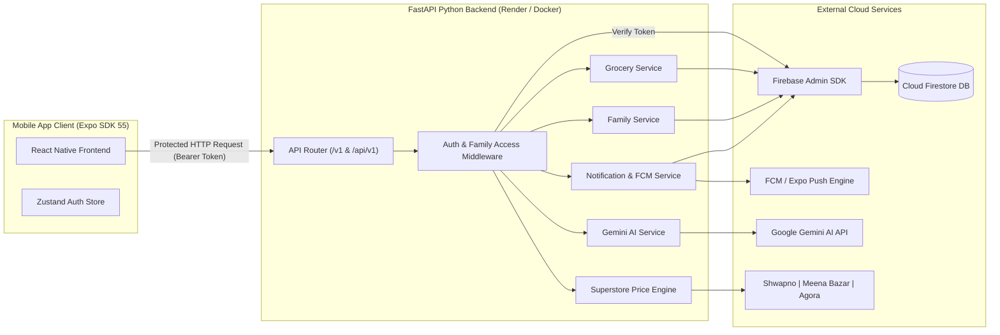
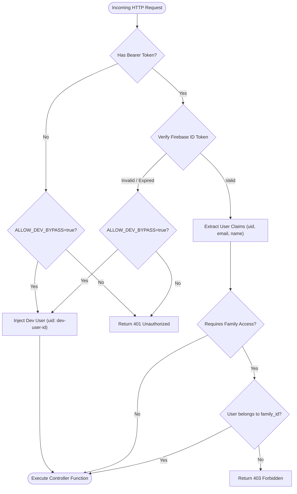
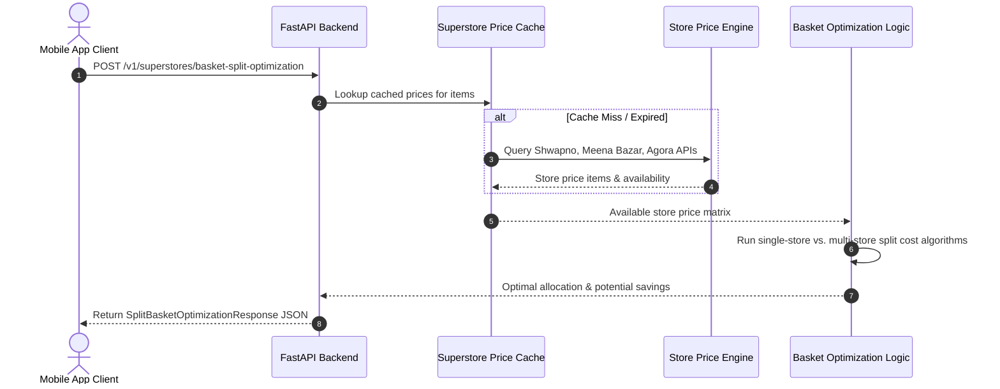

# 🛒 Family Grocery Data API

<div align="center">


**A high-performance, async Python data backend service built with FastAPI, Firebase Admin SDK, Cloud Firestore, Google Gemini AI, and Pydantic v2.**

[](https://fastapi.tiangolo.com/)
[](https://www.python.org/)
[](https://firebase.google.com/)
[](https://ai.google.dev/)
[](https://docs.pydantic.dev/)
[](https://www.docker.com/)
[](https://render.com/)
[](./LICENSE)

[Overview](#-overview) • [Key Features](#-key-features) • [Tech Stack](#-tech-stack) • [Architecture](#-architecture--sequence-diagrams) • [Getting Started](#-getting-started) • [Environment Variables](#-environment-variables-reference) • [API Reference](#-complete-api-reference) • [Firestore Schema](#-firestore-data-schema) • [Deployment](#-deployment) • [License](#-license)

</div>

---

## 📌 Overview

**Family Grocery Data API** is the dedicated Python microservice powering server-side operations, real-time superstore price intelligence, push notifications, and AI analytics for the [Family Grocery List](https://github.com/mehedihassandev/Family-Grocery-List) mobile ecosystem.

It leverages the **Firebase Admin SDK** to bypass client-side security bottlenecks, perform server-side Firestore mutations, orchestrate multi-user family groups, compare grocery prices across major Bangladesh superstores (**Shwapno**, **Meena Bazar**, **Agora**), calculate split-basket cost minimization strategies, and generate AI-driven grocery recommendations using **Google Gemini AI**.

---

## ✨ Key Features

### 👨‍👩‍👧‍👦 Family Workspace & Member Administration

- **Server-Side Family Management**: Create family groups, handle join requests via 6-character invite codes, update member roles (`owner`, `admin`, `member`), or safely remove members.
- **Access Control & Permissions**: Strict token claim and Firestore verification enforcing family-level data isolation.

### 📝 Real-Time Grocery Data Operations

- **Full Grocery Item Lifecycle**: Create, list, retrieve, update, and delete grocery items directly in Cloud Firestore.
- **Priority & Categorization**: Full support for item priority tags (`Urgent`, `High`, `Medium`, `Low`) and structured categories.
- **One-Click Instant Seeding**: Populate sample grocery items in 1 click (`POST /v1/families/{family_id}/seed`) for rapid developer testing.
- **Aggregated Family Stats**: Generate instant metrics for total items, pending, completed, urgent items, and category breakdowns.

### 🏪 Superstore Price Comparison & Basket Optimizer

- **Multi-Store Price Engine**: Real-time pricing & availability search across **Shwapno**, **Meena Bazar**, and **Agora**.
- **Single-Store Basket Optimizer**: Identifies the single most cost-effective superstore for an entire grocery list.
- **Multi-Store Split Strategy**: Calculates an item-by-item split ordering strategy across stores to maximize savings.
- **Price Drop Alerts Engine**: Set target prices on items and trigger market scans to detect price drops.

### 🔔 Push Notifications & In-App Activity Feed

- **FCM & Expo Token Registration**: Register device tokens (`POST /v1/users/me/device-tokens`) for real-time mobile push notifications.
- **In-App Activity Feed**: Query per-family notification feeds, track unread counts for app badges, and perform bulk mark-as-read operations.

### 🤖 Google Gemini AI Integration

- **Recipe-to-Grocery Converter**: Parse natural language recipe prompts (e.g. _"Beef Biryani for 6 people"_) into structured grocery items with estimated prices.
- **Monthly Spending Insights**: Generate natural language spending analysis, key recommendations, and cost-reduction opportunities.

---

## 🛠 Tech Stack

| Layer                | Technology                                                         | Version         | Purpose                                                |
| :------------------- | :----------------------------------------------------------------- | :-------------- | :----------------------------------------------------- |
| **Framework**        | [FastAPI](https://fastapi.tiangolo.com/)                           | `>=0.115.0`     | High-performance ASGI Web Framework                    |
| **Runtime**          | [Python](https://www.python.org/)                                  | `>=3.11`        | Modern Python runtime                                  |
| **Database & Auth**  | [Firebase Admin SDK](https://firebase.google.com/docs/admin/setup) | `>=6.5.0`       | Cloud Firestore & Firebase Auth Server SDK             |
| **Data Validation**  | [Pydantic](https://docs.pydantic.dev/)                             | `>=2.8.0`       | Strictly typed schema validation & settings management |
| **AI Engine**        | [Google Gemini AI](https://ai.google.dev/)                         | Latest REST API | Recipe parsing & monthly spending insights             |
| **ASGI Server**      | [Uvicorn](https://www.uvicorn.org/)                                | `>=0.30.0`      | Lightning-fast async server                            |
| **Testing Engine**   | [Pytest](https://docs.pytest.org/)                                 | `>=8.0.0`       | Unit & API integration test runner                     |
| **Code Quality**     | [Ruff](https://docs.astral.sh/ruff/)                               | `>=0.8.0`       | Extremely fast Python linter & formatter               |
| **Containerization** | [Docker](https://www.docker.com/)                                  | Multi-stage     | Production image packaging                             |
| **Cloud Hosting**    | [Render](https://render.com/)                                      | Web Service     | Automatic Blueprint deployment & SSL hosting           |

---

## 🏗 Architecture & Sequence Diagrams

### System Architecture



### Authentication & Authorization Flow



### Superstore Price Comparison & Basket Optimization Flow



---

## 📁 Project Structure

```text
Family-Grocery-Backend/
├── app/
│   ├── main.py                   # FastAPI initialization, CORS & global exception handlers
│   ├── api/
│   │   ├── router.py             # Route registration (/v1 and /api/v1 prefixes)
│   │   ├── dependencies.py       # Auth dependencies (Firebase ID token & family permissions)
│   │   └── routes/
│   │       ├── ai.py             # Gemini AI recipe converter & monthly insights endpoints
│   │       ├── family.py         # Family creation, join, invite & role management endpoints
│   │       ├── grocery.py        # Grocery item CRUD, seed & summary endpoints
│   │       ├── health.py         # Health check & server status endpoints
│   │       ├── notification.py   # FCM device tokens & in-app notification feed endpoints
│   │       ├── superstores.py    # Price search, basket optimization & alert endpoints
│   │       └── user.py           # User profile & session endpoints
│   ├── core/
│   │   ├── config.py             # Environment configuration settings (Pydantic BaseSettings)
│   │   └── firebase.py           # Firebase Admin SDK & Firestore client initialization
│   ├── models/                   # Pydantic v2 schemas
│   │   ├── ai.py                 # AI request & response models
│   │   ├── family.py             # Family, User, Invite & Role models
│   │   ├── grocery.py            # Grocery item, summary & actor models
│   │   ├── notification.py       # Device token & notification feed models
│   │   └── superstores.py        # Store price, basket & price alert models
│   └── services/                 # Core business logic & Firestore integration
│       ├── ai.py                 # Gemini AI integration logic
│       ├── family.py             # Family membership & invite logic
│       ├── grocery.py            # Grocery CRUD, seeding & summary calculation
│       ├── notification.py       # Push notification dispatch & in-app feed logic
│       └── superstores.py        # Store scraping, price search & basket optimization algorithms
├── tests/                        # Comprehensive Pytest suite (73 tests)
│   ├── test_ai_api.py
│   ├── test_family_api.py
│   ├── test_family_service.py
│   ├── test_grocery_api.py
│   ├── test_grocery_summary.py
│   ├── test_notifications.py
│   └── test_superstores_api.py
├── .env.example                  # Template for environment variables
├── Dockerfile                    # Container build configuration
├── pyproject.toml                # Project metadata, dependencies & ruff/pytest config
├── render.yaml                   # Render.com Blueprint infrastructure file
└── README.md                     # Project documentation
```

---

## 🚀 Getting Started

### 1. Prerequisites

- **Python**: `>=3.11`
- **Firebase Project**: Cloud Firestore enabled with Service Account credentials JSON
- **Google Gemini API Key**: Optional for AI recipe parsing and monthly insights

---

### 2. Installation & Environment Setup

1. **Clone the Repository**

    ```bash
    git clone https://github.com/mehedihassandev/Family-Grocery-List-Backend.git
    cd Family-Grocery-List-Backend
    ```

2. **Create and Activate Virtual Environment**

    ```bash
    python3 -m venv .venv
    source .venv/bin/activate
    ```

3. **Install Dependencies**

    ```bash
    pip install -e ".[dev]"
    ```

4. **Setup Environment File**
    ```bash
    cp .env.example .env
    ```

---

## 🔑 Environment Variables Reference

Populate `.env` with your Firebase project credentials and settings:

```env
# Firebase Configuration
FIREBASE_PROJECT_ID=your-firebase-project-id
FIREBASE_SERVICE_ACCOUNT_JSON=/absolute/path/to/firebase-service-account.json

# CORS Configuration
ALLOWED_ORIGINS=http://localhost:8081,http://localhost:19006,http://localhost:3000

# Security Bypass for Local Development
ALLOW_DEV_BYPASS=true

# AI & Superstore Features
GEMINI_API_KEY=your-google-gemini-api-key
SUPERSTORE_CACHE_TTL_HOURS=6

# Server Host & Port Configuration
HOST=127.0.0.1
PORT=8000
RELOAD=true
```

| Variable                        | Required |   Default   | Description                                     |
| :------------------------------ | :------: | :---------: | :---------------------------------------------- |
| `FIREBASE_PROJECT_ID`           | **Yes**  |   `None`    | Firebase Console project ID                     |
| `FIREBASE_SERVICE_ACCOUNT_JSON` | **Yes**  |   `None`    | Path to service account JSON or raw JSON string |
| `ALLOWED_ORIGINS`               |    No    |    `""`     | Comma-separated CORS allowed origin URLs        |
| `ALLOW_DEV_BYPASS`              |    No    |   `true`    | Enables dev auth bypass when token is missing   |
| `GEMINI_API_KEY`                | Optional |   `None`    | Google Gemini AI API key                        |
| `SUPERSTORE_CACHE_TTL_HOURS`    |    No    |     `6`     | Superstore price scraping cache TTL in hours    |
| `HOST`                          |    No    | `127.0.0.1` | Local server binding host                       |
| `PORT`                          |    No    |   `8000`    | Local server port                               |

---

### 3. Run Development Server

```bash
uvicorn app.main:app --reload
```

The server will start at `http://127.0.0.1:8000`.

- 📖 **Interactive Swagger UI**: [`http://127.0.0.1:8000/docs`](http://127.0.0.1:8000/docs)
- 📑 **ReDoc Documentation**: [`http://127.0.0.1:8000/redoc`](http://127.0.0.1:8000/redoc)

---

## 📚 Complete API Reference

All protected endpoints require an HTTP `Authorization` header:

```http
Authorization: Bearer <FIREBASE_ID_TOKEN>
```

### 1. System & Health Endpoints

| Method | Endpoint  | Auth  | Description                                 |
| :----- | :-------- | :---: | :------------------------------------------ |
| `GET`  | `/`       | ❌ No | Service health status and application title |
| `GET`  | `/health` | ❌ No | Health check returning `{"status": "ok"}`   |

---

### 2. User Profile Endpoint

| Method | Endpoint       |  Auth  | Description                                            |
| :----- | :------------- | :----: | :----------------------------------------------------- |
| `GET`  | `/v1/users/me` | 🔒 Yes | Fetch current user profile, role, and active family ID |

---

### 3. Family Management Endpoints

| Method   | Endpoint                                          |  Auth  | Description                                                               |
| :------- | :------------------------------------------------ | :----: | :------------------------------------------------------------------------ |
| `POST`   | `/v1/families`                                    | 🔒 Yes | Create a new family group. Returns `Family` with 6-character `inviteCode` |
| `POST`   | `/v1/families/join`                               | 🔒 Yes | Join an existing family group via `inviteCode`                            |
| `GET`    | `/v1/families/{family_id}`                        | 🔒 Yes | Retrieve family metadata, owner ID, and creation date                     |
| `GET`    | `/v1/families/{family_id}/members`                | 🔒 Yes | List all user profiles in a family group                                  |
| `POST`   | `/v1/families/{family_id}/members`                | 🔒 Yes | Invite a user to a family by email                                        |
| `PATCH`  | `/v1/families/{family_id}/members/{user_id}/role` | 🔒 Yes | Update member role (`owner`, `admin`, `member`) — _Owner only_            |
| `POST`   | `/v1/families/{family_id}/leave`                  | 🔒 Yes | Leave current family group                                                |
| `DELETE` | `/v1/families/{family_id}/members/{user_id}`      | 🔒 Yes | Remove member from family group — _Owner only_                            |

---

### 4. Grocery List & Summary Endpoints

| Method   | Endpoint                                   |  Auth  | Description                                                      |
| :------- | :----------------------------------------- | :----: | :--------------------------------------------------------------- |
| `GET`    | `/v1/families/{family_id}/items`           | 🔒 Yes | List all grocery items for a family                              |
| `POST`   | `/v1/families/{family_id}/items`           | 🔒 Yes | Add a new grocery item to Firestore                              |
| `GET`    | `/v1/families/{family_id}/items/{item_id}` | 🔒 Yes | Fetch details of a specific grocery item                         |
| `PATCH`  | `/v1/families/{family_id}/items/{item_id}` | 🔒 Yes | Update grocery item (status, priority, notes, quantity)          |
| `DELETE` | `/v1/families/{family_id}/items/{item_id}` | 🔒 Yes | Delete item from Firestore                                       |
| `POST`   | `/v1/families/{family_id}/seed`            | 🔒 Yes | **Instant Seed**: Populate 5 sample items to Firestore instantly |
| `GET`    | `/v1/families/{family_id}/grocery-summary` | 🔒 Yes | Fetch aggregated stats (total, pending, completed, urgent items) |

#### Add Grocery Item Payload (`POST /v1/families/{family_id}/items`):

```json
{
    "name": "Soyabean Oil",
    "category": "Drinks",
    "priority": "Urgent",
    "quantity": "5 Liters",
    "notes": "Teer or Rupchanda brand"
}
```

---

### 5. Push Notifications & Activity Feed Endpoints

| Method   | Endpoint                                                        |  Auth  | Description                                              |
| :------- | :-------------------------------------------------------------- | :----: | :------------------------------------------------------- |
| `POST`   | `/v1/users/me/device-tokens`                                    | 🔒 Yes | Register FCM / Expo push token for current user device   |
| `DELETE` | `/v1/users/me/device-tokens/{token}`                            | 🔒 Yes | Remove push token on app logout                          |
| `GET`    | `/v1/families/{family_id}/notifications`                        | 🔒 Yes | Fetch in-app notification feed (query param: `limit=50`) |
| `GET`    | `/v1/families/{family_id}/notifications/unread-count`           | 🔒 Yes | Fetch total unread notifications count for badge display |
| `PATCH`  | `/v1/families/{family_id}/notifications/{notification_id}/read` | 🔒 Yes | Mark a single notification as read                       |
| `POST`   | `/v1/families/{family_id}/notifications/read-all`               | 🔒 Yes | Mark all notifications in family as read                 |

---

### 6. Superstore Price Comparison & Alert Endpoints

| Method   | Endpoint                                    |  Auth  | Description                                                                  |
| :------- | :------------------------------------------ | :----: | :--------------------------------------------------------------------------- |
| `GET`    | `/v1/superstores/search`                    | 🔒 Yes | Price & stock search across Shwapno, Meena Bazar, Agora. Params: `q`, `unit` |
| `POST`   | `/v1/superstores/basket-optimization`       | 🔒 Yes | Calculate single cheapest superstore for a grocery list                      |
| `POST`   | `/v1/superstores/basket-split-optimization` | 🔒 Yes | Calculate multi-store split ordering strategy to maximize savings            |
| `POST`   | `/v1/superstores/price-alerts`              | 🔒 Yes | Create target price drop alert                                               |
| `GET`    | `/v1/superstores/price-alerts`              | 🔒 Yes | List active price alerts for family (query param: `family_id`)               |
| `DELETE` | `/v1/superstores/price-alerts/{alert_id}`   | 🔒 Yes | Delete price drop alert                                                      |
| `GET`    | `/v1/superstores/price-alerts/check`        | 🔒 Yes | Trigger market check against active alerts                                   |

#### Basket Split Optimization Payload (`POST /v1/superstores/basket-split-optimization`):

```json
{
    "familyId": "family-123",
    "items": ["Soyabean Oil 5L", "Miniket Rice 5kg", "Eggs 12pcs"]
}
```

---

### 7. Gemini AI Endpoints

| Method | Endpoint                   |  Auth  | Description                                                            |
| :----- | :------------------------- | :----: | :--------------------------------------------------------------------- |
| `POST` | `/v1/ai/recipe-to-grocery` | 🔒 Yes | Convert natural language recipe into structured grocery items & prices |
| `POST` | `/v1/ai/monthly-insights`  | 🔒 Yes | Generate natural language spending insights & cost-saving tips         |

#### Recipe to Grocery Payload (`POST /v1/ai/recipe-to-grocery`):

```json
{
    "recipePrompt": "Kacchi Biryani for 8 people with borhani",
    "servings": 8
}
```

---

## 🗄 Firestore Data Schema

### 👤 `users` Collection

```json
{
    "uid": "string (Firebase Auth UID)",
    "email": "string",
    "displayName": "string",
    "photoURL": "string | null",
    "familyId": "string | null",
    "role": "owner | member | admin",
    "updatedAt": "timestamp"
}
```

### 👨‍👩‍👧‍👦 `families` Collection

```json
{
    "id": "string (Document ID)",
    "name": "string",
    "inviteCode": "string (6-character code)",
    "ownerId": "string (UID)",
    "createdAt": "timestamp"
}
```

### 🛒 `grocery_items` Collection

```json
{
  "id": "string",
  "familyId": "string",
  "name": "string",
  "category": "Beauty | Meat | Fish | Vegetables | Fruits | Dairy | Snacks | Drinks | Household | Medicine | Other",
  "priority": "Urgent | High | Medium | Low",
  "quantity": "string | null",
  "notes": "string | null",
  "status": "pending | completed",
  "addedBy": { "uid": "string", "name": "string", "photoURL": "string | null" },
  "completedBy": { "uid": "string", "name": "string", "photoURL": "string | null" } | null,
  "createdAt": "timestamp",
  "updatedAt": "timestamp",
  "completedAt": "timestamp | null"
}
```

### 🔔 `notifications` Collection

```json
{
    "id": "string",
    "familyId": "string",
    "recipientUid": "string",
    "actorUid": "string",
    "actorName": "string",
    "title": "string",
    "body": "string",
    "type": "ITEM_ADDED | ITEM_COMPLETED | ITEM_UPDATED | MEMBER_JOINED",
    "data": { "familyId": "string", "itemId": "string" },
    "isRead": false,
    "createdAt": "timestamp"
}
```

---

## 🧪 Testing & Code Quality

Run unit and integration tests with coverage and linting checks:

```bash
# Run pytest test suite (73 test cases)
pytest

# Check code formatting & linting with Ruff
ruff check app tests

# Auto-fix fixable linting issues
ruff check --fix app tests
```

---

## 🐳 Docker Deployment

Build and run containerized service locally:

```bash
# Build Docker image
docker build -t family-grocery-backend .

# Run container on port 8000
docker run -d -p 8000:8000 --env-file .env family-grocery-backend
```

---

## ☁️ Deployment on Render.com

This repository includes a [`render.yaml`](./render.yaml) Blueprint file for 100% free hosting on Render:

1. Push code to your GitHub repository.
2. Go to [Render Dashboard](https://dashboard.render.com/) and click **New +** → **Blueprint**.
3. Select your repository. Render will automatically configure `family-grocery-data-api`.
4. Set required Environment Variables in Render Dashboard:
    - `FIREBASE_SERVICE_ACCOUNT_JSON`: Raw string contents of your service account JSON file.
    - `GEMINI_API_KEY`: Your Google Gemini API key.
5. Deploy service. Once deployed, copy your free HTTPS API URL (e.g. `https://family-grocery-data-api.onrender.com`).

---

## 📄 License & Contribution

Distributed under the **MIT License**. See [`LICENSE`](./LICENSE) for details.

<div align="center">

Made with ❤️ by [Mehedi Hassan](https://github.com/mehedihassandev) and community contributors.

</div>
